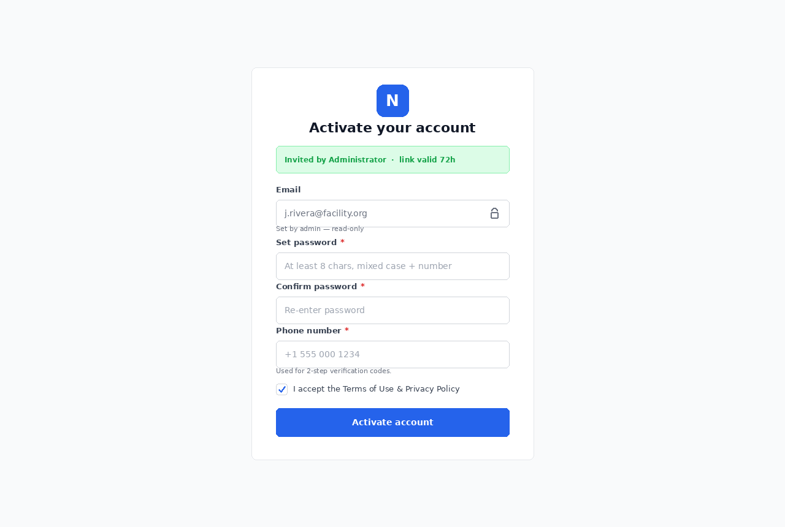

4 trường
email
pws 
confirm pwd
phone number

khá là bối rối, nhìn giống form đăng ký nhưng không phải
có invited +  activion => là nhận user đã điền form đăng ký với email trên web, sau đó backend gởi link activation đến và user mới thực sự đăng ký và tạo tài khoản?
các điều kiện cần check?

đã check thêm sc005 đã hiểu

=> api này chỉ cần xác nhận token( hợp lệ và chưa hết hạn), pwd + phone number  => log vào db bảng users ( 1 vài cột thôi, không phải toàn bộ)
tuy nhiên nếu phone number ở đây khác với cái sc005 thì sao? khả năng là lấy phonenumber ở đây vì ở đây bắt buộc còn ở sc005 thì optional