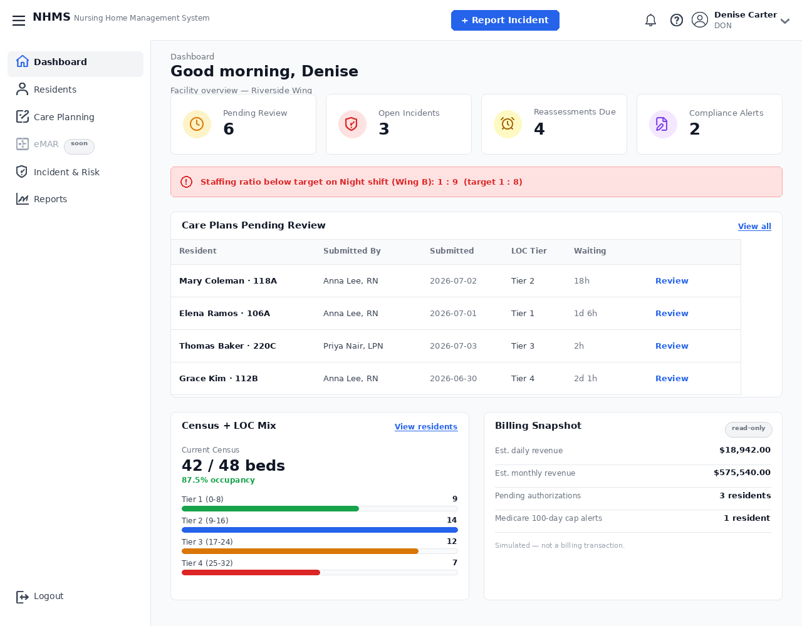

dashboard DON
nurse tạo care plan submit => don review

Screen/Feature ID: SC_015_SH-US-01_dashboard-don

User Story 1
As a Director of Nursing (DON), I want to view a high-level management dashboard, so that I can evaluate facility-wide compliance metrics, staff coverage ratios, and total critical incident volumes.
Acceptance Criteria:
Given the DON accesses their dashboard layout
When the screen renders
Then the dashboard must aggregate data across all floors and display high-level management charts: "Overall Facility Occupancy", "Staffing Ratio Deficiencies for Current Shift", and "Incident Report Summary".
User Story 2
As a Director of Nursing (DON), I want to receive instant dashboard push notifications for unassigned shifts or open severe incident investigations, so that I can ensure immediate management oversight.
Acceptance Criteria:
Given an Incident Report is submitted with a severity flag of "Critical"
When it hits the system
Then a global alert banner must immediately overlay on the DON's dashboard screen requiring them to acknowledge receipt of the high-risk alert.
User Story 3
As a Director of Nursing (DON), I want to click through the facility aggregate metrics widgets, so that I can drill down into granular sub-reports per unit or floor.
Acceptance Criteria:
Given the DON is inspecting the "Weekly Incident Summary" bar chart
When they click on a specific data bar.
Then the system must redirect them to a filtered list view showing only the source reports generated by that particular facility wing.
