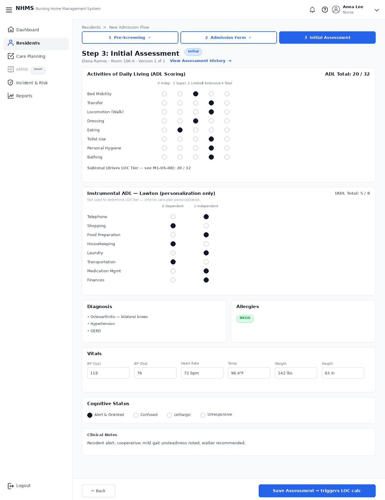

dashboard DON

input:  get resident( id oly, maybe mock)
        get assessment_metrics(only catagory = ADL): user input => lưu mỗi record vào assessment_details				
        vital_signs( harcode because it's the name of col in table)
note: skip intrumental ADL								
